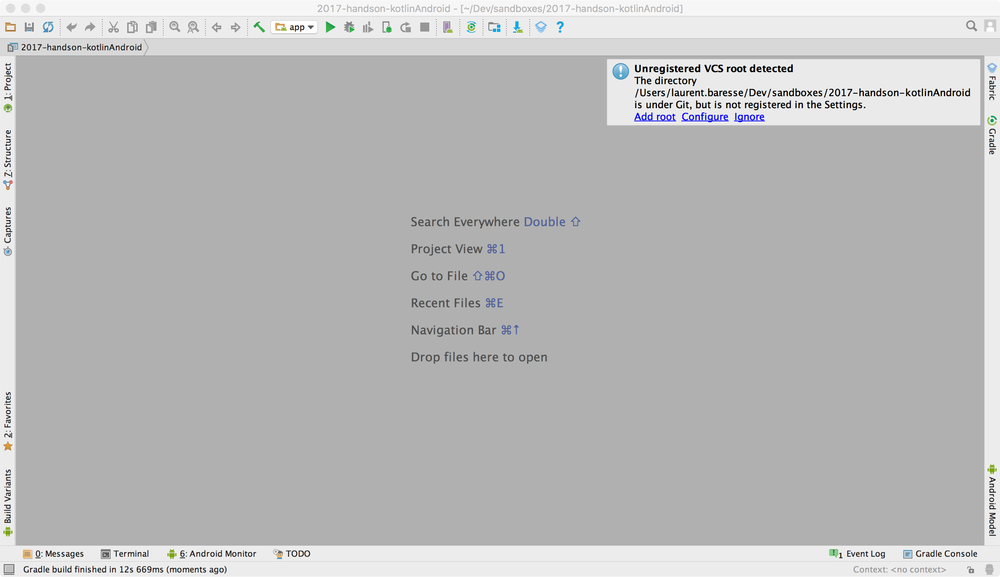
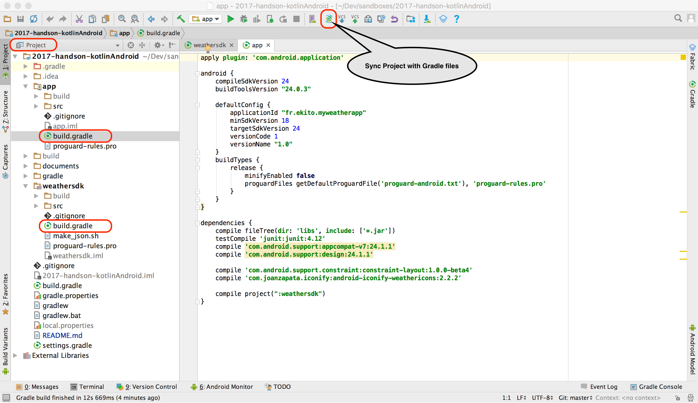

# 2017-handson-kotlinAndroid

This project contains the Hands-on material. 


## First steps

* Clone repository and the `master` branch

```
git clone https://github.com/Ekito/2017-handson-kotlinAndroid.git
```

* Open AndroidStudio
* Import project 


* Click on `Add Root`



* Click on the button `Sync Project with Gradle files`



* If you have gradle errors, depending on the WIFI health either :
  * download build tools version 24.0.3 from Internet
  * modify the two `build.gradle` files with your installed version (assuming it's greater than 24.0.3).

* Create your own GIT branch `mywork`. Open a Terminal in AndroidStudio and type :

```
git checkout -b mywork
```

* You are ready to work. Grab the [Kotlin Hands-on document](https://github.com/Ekito/2017-handson-kotlinAndroid/blob/master/documents/Kotlin_Hands-on.md) and enjoy.


## GIT 
If you are not fluent with GIT. Please check our [Git cheatsheet aka Survival guide](https://github.com/Ekito/2017-handson-kotlinAndroid/blob/master/documents/Git_cheatsheet_aka_Survival_guide.md).

You will find : 

* How to clone a GIT repository ?
* How to configure GIT log ? 
* How to create a new branch ?
* You are stucked on an exercice. How to catch up with our provided solution without loosing your current work ?

## WIFI is dead ? 
May be the WIFI will not be able to serve any more connection for you. 

***Don't Panic !***

Just follow our provided offline installation guide. Estimated time to a complete setup (~ 20 minutes). So start to install it during our presentation in order to be ready just after when you will have to work. 

* [Hands-on offline setup for Mac](https://github.com/Ekito/2017-handson-kotlinAndroid/blob/master/documents/Mac_Hands-on_Setup.md)
* [Hands-on offline setup for Linux](https://github.com/Ekito/2017-handson-kotlinAndroid/blob/master/documents/Linux_Hands-on_Setup.md)
* [Hands-on offline setup for Windows](https://github.com/Ekito/2017-handson-kotlinAndroid/blob/master/documents/Windows_Hands-on_Setup.md)
