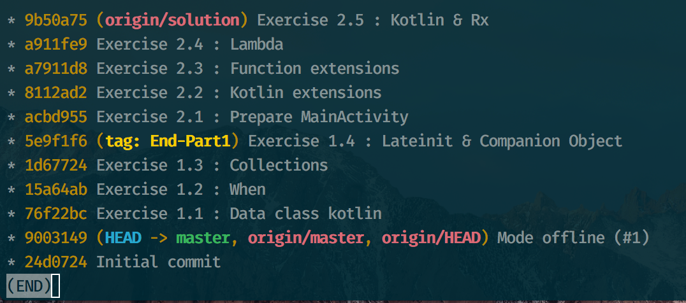

# Git cheatsheet aka "Survival guide"


### Clone Github repository

* Clone repository and the `master` branch 

```
git clone https://github.com/Ekito/2017-handson-kotlinAndroid.git
```

* Fetch the `solution` branch 

```
git fetch origin solution:solution
```

* Check your Git log : `git lg` or `git log`

### Configuration for `git log`

Create an alias in order to better display git log. 

* Open a terminal
* Go to the project directory
* Type the following command:

```
git config --local alias.lg 'log --oneline --all --graph --decorate'
```

Try your fresh new alias :  `git lg`



### Initialize your git environment

* Create your own branch `mywork` 

```
git checkout -b mywork
```

* Then type : `git lg`

```
* 9b50a75 (origin/solution, solution) Exercise 2.5 : Kotlin & Rx
* a911fe9 Exercise 2.4 : Lambda
* a7911d8 Exercise 2.3 : Function extensions
* 8112ad2 Exercise 2.2 : Kotlin extensions
* acbd955 Exercise 2.1 : Prepare MainActivity
* 5e9f1f6 (tag: End-Part1) Exercise 1.4 : Lateinit & Companion Object
* 1d67724 Exercise 1.3 : Collections
* 15a64ab Exercise 1.2 : When
* 76f22bc Exercise 1.1 : Data class kotlin
* 9003149 (HEAD -> mywork, master, origin/master, origin/HEAD) Mode offline (#1)
* 24d0724 Initial commit
```

### You are blocked during the first part of the lab...

Retrieve the project source with provided solution. For instance let's imagine you're blocked on *Ex.1* and you want to start to work on *Ex.2*.

* Commit your current work on your current branch

```
git add .
git commit -m "WIP : Blocked on Ex.1"
```

* Create a new branch `mywork-after-ex1` on the requested commit (here `76f22bc `: *Ex.1* solved)

```
git checkout 76f22bc -b mywork-after-ex1
```

* Then type : `git lg`

```
* 9b50a75 (origin/solution, solution) Exercise 2.5 : Kotlin & Rx
* a911fe9 Exercise 2.4 : Lambda
* a7911d8 Exercise 2.3 : Function extensions
* 8112ad2 Exercise 2.2 : Kotlin extensions
* acbd955 Exercise 2.1 : Prepare MainActivity
* 5e9f1f6 (tag: End-Part1) Exercise 1.4 : Lateinit & Companion Object
* 1d67724 Exercise 1.3 : Collections
* 15a64ab Exercise 1.2 : When
* 76f22bc (HEAD -> mywork-after-ex1) Exercise 1.1 : Data class kotlin
* 9003149 (master, origin/master, origin/HEAD) Mode offline (#1)
* 24d0724 Initial commit
```

### You don't have finished all the exercises, and part 2 is begining...

* Commit your current work on your current branch

```
git add .
git commit -m "WIP : Part 1 not finished"
```

* Create a new branch `mywork-sync-part2` on the tag `End-Part1`

```
git checkout End-Part1 -b mywork-sync-part2
```

then type : `git lg`

```
* 9b50a75 (origin/solution, solution) Exercise 2.5 : Kotlin & Rx
* a911fe9 Exercise 2.4 : Lambda
* a7911d8 Exercise 2.3 : Function extensions
* 8112ad2 Exercise 2.2 : Kotlin extensions
* acbd955 Exercise 2.1 : Prepare MainActivity
* 5e9f1f6 (HEAD -> mywork-sync-part2, tag: End-Part1) Exercise 1.4 : Lateinit & Companion Object
* 1d67724 Exercise 1.3 : Collections
* 15a64ab Exercise 1.2 : When
* 76f22bc (HEAD -> mywork-after-ex1) Exercise 1.1 : Data class kotlin
* 9003149 (master, origin/master, origin/HEAD) Mode offline (#1)
* 24d0724 Initial commit
```
