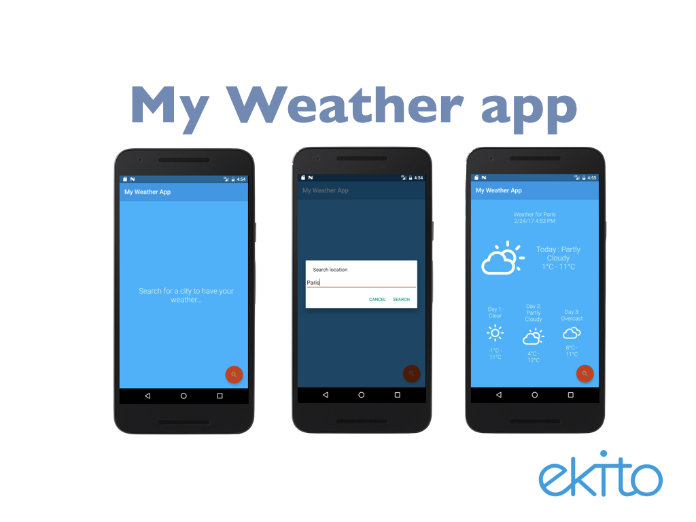
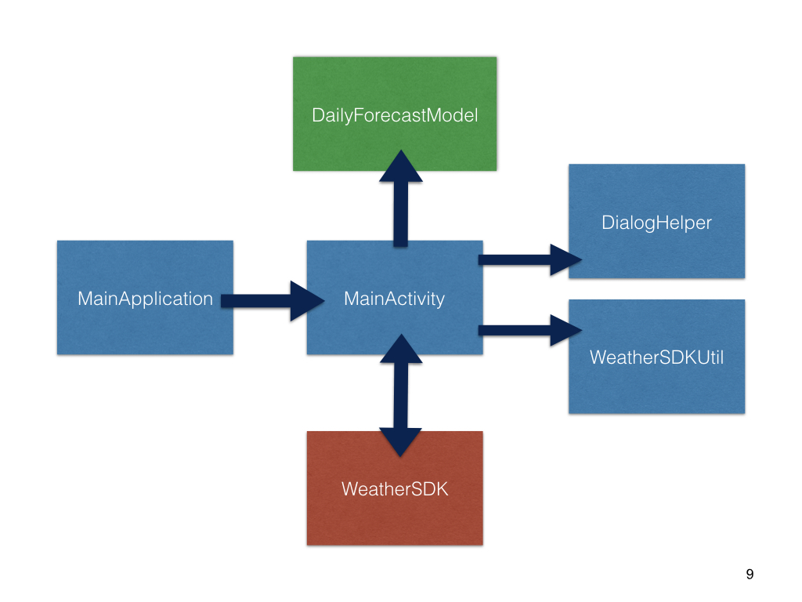
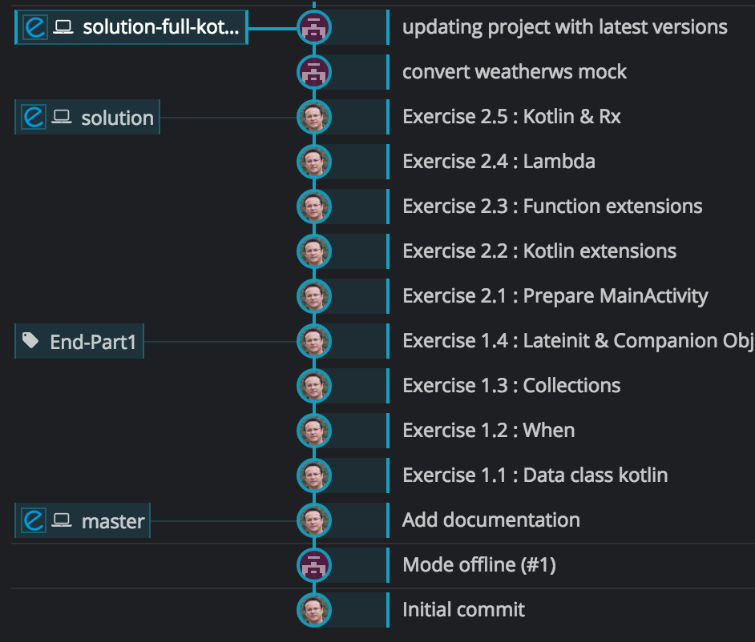
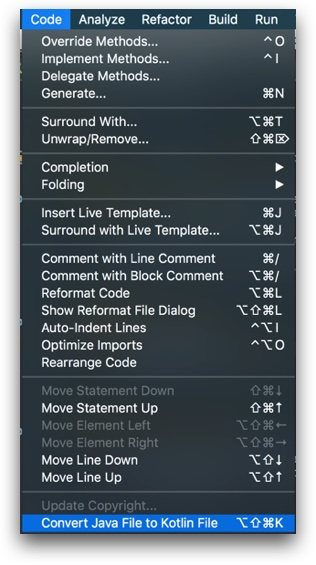
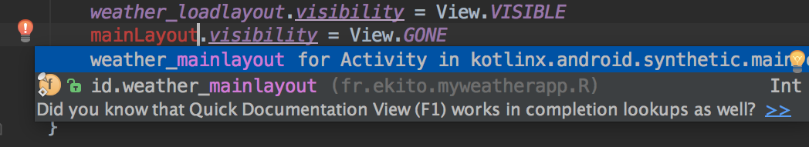

# 2017-handson-kotlinAndroid




## Tour de l'application



* `MainApplication` : Point d'entrée de l'application Android
* `MainActivity` : *Activity* principale de l'application (coordonne les web services et l'affichage)
* `DailyForecastModel` : Modèle de données pour l'affichage de la météo
* `WeatherUtilSDK` : Helper de mise en forme des données météo
* `DialogHelper` : Helper d'affichage de boite de dialogue
* `WeatherSDK` : Module/SDK Android qui offre les services pour la météo (geocoding et météo)

## Pré-requis

* Git
* AndroidStudio 2.2+
* Android SDK API 24
* Build tools 24.0.3+
* Plugin Kotlin (1.0.6+)
* VM ou téléphone Android


Lancer le projet *Java* au moins une fois pour vérifier la compliation, le chargement des dépendances et pour voir l'application fonctionner avant sa transformation en Kotlin.

## Détails du projet Git

Le dépôt GIT est constitué de plusieurs branches, comme illustré ci-dessous :



* `master` : Il s'agit de la branche à partir de laquelle vous devez partir pour travailler sur le Hands-on. Elle contient le projet dans sa version Java.
* `solution` : Elle contient l'ensemble des commits étape par étape de la solution. Il y a un commit par exercice. Si vous êtes bloqué vous pouvez simplement regarder le commit de la solution qui vous intéresse ou bien créer une branche à partir d'un commit de la solution. N'hésitez pas à nous solliciter si besoin pour les manipulations `git`. **Notez le tag `End-Part1` qui vous permettra si besoin de raccrocher les wagons après la pause en milieu de session.**
* `solution-full-kotlin-1.1-rxjava2` : Elle contient la partie bonus indiqué à la fin du Hands-on dans laquelle le module `WeatherSDK` a été aussi entièrement migré en Kotlin 1.1 et RXJava2.

# Exercices (Série 1)


## Ex.1.1 - Premier contact avec Kotlin

Utilisation de la commande "magique" : 



La classe `DailyForecastModel` est dédiée au stockage des données métiers (données en lecture seule et nullsafety)

**TODO :** Transformer la classe ci-dessus en [data class](https://kotlinlang.org/docs/reference/data-classes.html) Kotlin

* Utilisation de l'IDE (menu code/Kotlin)
* Validation de l'intégration de Kotlin dans le projet 
	* Mise à jour des fichiers gradle automatiquement
	* Refresh gradle (depuis IDE)
	* Décommenter `kotlin.incremental=true` dans le fichier `gradle.properties` (à la racine du projet)

**TODO :** Nettoyage de classe, au strict minimum requis pour la data class 

* les propriétés sont maintenant toutes immutables (`val`) et directement déclarées dans le constructeur
* Toutes les propriétés sont de type `String` (non nullable)

**Remarque :** la fonction métier `getTemperatureString` a été transformée en propriété Kotlin, dotée d'un getter seulement. 
on pourrait simplifier à l'expression suivante : 
`val temperatureString = "$temperatureLow°C - $temperatureHigh°C"`

**Remarque :** On utilise déjà l'interop java/kotlin et sans aucune modification du code existant ! On utilise également le [string template](https://kotlinlang.org/docs/reference/basic-types.html#string-templates) Kotlin naturellement, pour formater simplement la propriété `temperatureString`.


## Ex.1.2 - Retravailler la WeatherSDKUtil - When

Kotlin possède un type de classe à instance unique (singleton) : le [type Object](https://kotlinlang.org/docs/reference/object-declarations.html#object-declarations). C'est l'outil idéal pour les classes helper et autres classes avec des fonctions ou méthodes statiques.

**TODO :** Convertir la classe `WeatherSDKUtil`

**Remarque :** Remarquez l'impact sur la classe `MainActivity`. Les appels vers cette classe utilisent directement l'interop Java/Kotlin :
```
List<DailyForecastModel> forecasts = WeatherSDKUtil.INSTANCE.getDailyForecasts(weather); 
```

**TODO :** Analyser la transformation de la méthode `getWeatherCode`. Le `switch` case a été remplacé par `when` :

```
 switch (icon) { 
            case CHANCE_STORMS: 
            case PREFIX + CHANCE_STORMS: 
            case TSTORMS: 
            case PREFIX + TSTORMS: 
                return WI_THUNDERSTORM; 
				...
            default: 
                return WI_DAY_CLOUDY; 
        } 
```
par 

```
when (icon) {
            CHANCE_STORMS, PREFIX + CHANCE_STORMS, TSTORMS, PREFIX + TSTORMS -> return WI_THUNDERSTORM
            ...
            else -> return WI_DAY_CLOUDY
            }
```

L'opérateur [`when`](https://kotlinlang.org/docs/reference/control-flow.html#when-expression) permet de travailler plus visuellement & simplement vis à vis des conditions testées. Il permet également d'adresser du *pattern matching* en travaillant sur des expressions et des valeurs (range expression, type checking ...). Exemple de pattern matching :

```
when(obj) {
 is String -> // matches on the type
 parseInt(obj) -> // invoked method parseInt
 else -> // otherwise
}
```


## Ex.1.3 - Retravailler la WeatherSDKUtil - Collections

**TODO :** Refactorer la méthode `extractLocation`. Utiliser le méthode `firstOrNull()` de l'[API Collection](https://kotlinlang.org/docs/reference/collections.html) Kotlin, pour refactorer cet algorithme en une seule ligne.

**Remarque :** Vous aller découvrir que l'attribut geometry peut être null, cas inaperçu en java
(erreur de compilation dans Android studio en Kotlin)

**TODO :** Refactorer `getDailyForecasts` & `filterForecast` en une seule fonction

Transformer l'algorithme en utilisant les [fonctions de l'API collections](https://kotlinlang.org/api/latest/jvm/stdlib/kotlin.collections/index.html) Kotlin (`map`, `filter`, `take`). Pour vous guider, vous trouverez en commentaire l'algorithme utilisable en java 8 / streams.

**Remarque :** Pas de typage explicite nécessaire, la transformation de type est assurée par le smartcast Kotlin. Pas besoin de collecter explictement les données sous forme de liste, les opérateurs transforment automatiquement dans le type adéquat ([smart casts](https://kotlinlang.org/docs/reference/typecasts.html#smart-casts)). Nous n'avons plus besoin de `filterForecast`.


## Ex.1.4 - Premier contact Kotlin & Android

**TODO :** Transformer la classe `MainApplication` en classe Kotlin

**Remarque :** On reste compatible avec les API Java existantes (interop Kotlin/Java). Les méthodes/attributs statiques vont être délégués à un [`companion object`](https://kotlinlang.org/docs/reference/object-declarations.html#companion-objects) pour nos méthodes utilitaires (**pas de static en Kotlin**).  

**TODO :** Résoudre le problème de compilation de la fonction `get()` (Type Optional à gérer, et prop). 

```
fun get(): Application {
            return instance
        }
```

Cette fonction doit retourner un `Application` et non pas `Application?` (on garantit le nullsafety pour le reste de l'application). On regardera [`l'initialisation tardive des propriétés`](https://kotlinlang.org/docs/reference/properties.html)

**Remarque :** Impacts sur la classe `MainActivity`, interop Java/Kotlin :

```
  DateFormat timeFormat = android.text.format.DateFormat.getTimeFormat(MainApplication.Companion.get()); 
  DateFormat dateFormat = android.text.format.DateFormat.getDateFormat(MainApplication.Companion.get()); 
```


# Exercices (Série 2)

## Ex.2.1 - Préparation de la classe MainActivity


**TODO :** Transformer la classe `MainActivity` en classe Kotlin

**TODO :** Corriger les problèmes de nullable introduit par la conversion, dans la méthode `getWeatherData`, en corrigeant le bloc suivant :

```
.switchMap(Func1<Location?, Observable<Weather>> { location -> WeatherSDK.getWeather(location!!.lat, location.lng) })
```

**Remarque :** Comme le montre IntelliJ, on peut supprimer le type `Func1<Location?, Observable<Weather>>` pour obtenir une simple [expression lambda](https://kotlinlang.org/docs/reference/lambdas.html#lambda-expression-syntax) : 

```
.switchMap { location -> WeatherSDK.getWeather(location!!.lat, location.lng) }
```


**-- Attention --** La classe ne compile toujours pas. Nous avons toujours des erreurs dans la méthode `updateWeatherUI`, à cause de l'utilisation de types optionals. La section suivante remédie à ce problème.

## Ex.2.2 - Activer les "kotlin extensions"

Chaque développeur Android connaît bien la fonction `findViewById()`, source de bugs potentiels et autres cauchemars. Bien qu'il existe plusieurs bibliothèques disponibles qui fournissent des solutions à ce problème, ces bibliothèques sont dépendantes de l'exécution (annotation pour chaque vue) et d'une partie runtime.

Le plugin [Kotlin Android Extensions](https://kotlinlang.org/docs/tutorials/android-plugin.html#using-kotlin-android-extensions) nous permet d'obtenir la même expérience, sans bibliothèque ni runtime supplémentaire.

**TODO :** Intégrer le plugin dans le module gradle de l'application, en insérant la ligne `apply plugin: 'kotlin-android-extensions'` dans le fichier `build.gradle`. Nous aurons donc cet entête de fichier : 

```
apply plugin: 'com.android.application'
apply plugin: 'kotlin-android'
apply plugin: 'kotlin-android-extensions'
```
Vous pouvez rafraichir votre projet android.

**TODO :** Gros coup de balai :) Miam KOTLIN c'est trop bon ! Mangez-en ! :D

* Supprimer toutes les propriétés de widget de la classe `MainActivity` (<=> toutes sauf la propriété `now`)
* Supprimer la fonction `findViewsById`, dans la méthode `onCreate`, ainsi que son appel
* Remplacer l'utilisation des anciens widgets, par leur les propriétés générées par kotlin-extension (utilisez l'autocomplétion). Exemple :

```
mainLayout!!.visibility = View.VISIBLE
```
remplacé par :

```
weather_main_layout.visibility = View.VISIBLE
```

Vérifier et ajouter si necessaire les imports suivants en tête de classe : 

```
import kotlinx.android.synthetic.main.activity_main.*
import kotlinx.android.synthetic.main.content_main.*
```

**-- Attention --** Le widget est construit automatiquement à partir de l'id renseigné dans le layout xml. L'IDE permet l'autocompletion, mais attention aux fautes de frappe ;)

```
<TextView
            android:id="@+id/weather_main_text"
            style="@style/Text.Thin.Big"
            android:layout_width="match_parent"
            android:layout_height="wrap_content"
            android:layout_centerInParent="true"
            android:layout_margin="16dp"
            android:layout_toEndOf="@id/weather_main_icon"
            android:gravity="center"
            android:text="Today's Weather text"
            android:textColor="@color/white" />
```

Un simple import via android studio, permet d'aller chercher le bon widget :




**-- Attention --** Faire attention à la conversion de l'ancienne propriété (textview) `title`, qui rentre en conflit par masquage avec l'attribut `title` de l'activity Android (sa classe mère). 

**Penser** à remplacer l'utilisation de cettte ancienne propriété par le widget `weather_title`. 


## Ex.2.3 - Extensions de fonctions

**TODO :** Enrichir la classe `Geocode` pour y intégrer une méthode `getGeocode() : Location? `, qui fait la même chose que notre méthode `extractLocation` de la classe `WeatherSDKUtil`.

* Créer le package `fr.ekito.myweatherlibrary.json.geocode` dans le module `app`, et y ajouter la fichier Kotlin `GeoCodeExt.kt`
* Créer l'extension de fonction `Geocode.getGeocode()`
* Supprimer la fonction `WeatherSDKUtil.extractLocation()`
* Mettre à jour le bloc de code appelant : 

```
.map { geocode -> WeatherSDKUtil.extractLocation(geocode) }
```
par une référence de fonction `Geocode::getGeocode`. 

**REMARQUE :** Kotlin a très souvent utilisé ce mécanisme d'extensions Kotlin pour enrichir les API Java (ex: les collections).

**TODO :** Enrichir la classe `Weather` pour y intégrer une méthode `getDailyForecasts(): List<DailyForecastModel>`, qui fait la même chose que notre méthode `getDailyForecasts(weather: Weather?) : List<DailyForecastModel>` de la classe `WeatherSDKUtil`.

* Créer le package `fr.ekito.myweatherlibrary.json.weather` dans le module `app`, et y ajouter la fichier Kotlin `WeatherExt.kt`
* Créer l'extension `getDailyForecasts(): List<DailyForecastModel>`
* Supprimer la méthode `getDailyForecasts(weather: Weather?)` de la classe `WeatherSDKUtil`
* Rappatrier les méthodes et propriétés nécessaires de la classe `WeatherSDKUtil`
* Mettre à jour la méthode `updateWeatherUI`


**REMARQUE :** La classe `WeatherSDKUtil` est désormais vide. Vous pouvez la supprimer ! :)


## Ex.2.4 - Fonctions & Lambdas

**TODO :** Transformation de l'interface de callback en [fonction](https://kotlinlang.org/docs/reference/functions.html) utilisable par lambda

* Convertir la classe `DialogHelper` en object Kotlin
* Supprimer le fichier interface `MainActivityWeatherCallback`. 
* Dans le nouveau `DialogHelper` remplacer `MainActivityWeatherCallback` par la fonction : `(View, String) -> Unit` dans la signature de la fonction `locationDialog()`
* Dans le corps de cette fonction `locationDialog()`, remplacer l'ancien appel `callback.getWeatherData` par l'invocation de la lambda passée en argument 
* Modifier le code pour appeler la lambda
* Dans la classe `MainActivity`, retirer la référence à `MainActivityWeatherCallback` et supprimer l'_override_ de la fonction de callback. 
* remplacer l'appel de du `DialogHelper` qui utilise `this@MainActivity` par une lambda appropriée

**REMARQUE :** `(View, String) -> Unit` est une fonction Kotlin qui prend 2 paramêtres en entrée (`View` & `String`) et qui ne retourne aucun résultat (`Unit`).

**CODE SMELL :** jusque présent on utilisait une Activity pour construire l'EditText `input` dans notre boite de dialogue. Nous n'avons plus d'Activity à passer dans l'argument `view`. Il faut désormais utiliser le constructeur `EditText(context : Context?)`

**OPTIMISATION :** la fonction de callback `(View, String) -> Unit` n'a plus besoin de renvoyer la `View` utilisée, puisque nous avons accès à cette même vue depuis `MainActivity`. Nous pouvons simplifier la signature du callback en : `(String) -> Unit`   

## Ex.2.5 - RxJava & Lambdas

**TODO :** Simplifier l'utilisation de l'API RxJava à l'aide des lambdas

* Remplacer l'utilisation de la méthode suivante :
`public final Subscription subscribe(final Observer<? super T> observer)`
par celle-ci et à l'aide de __lambdas__ :
`public final Subscription subscribe(final Action1<? super T> onNext, final Action1<Throwable> onError)`

**REMARQUE :** Nous n'utilisons plus d'`object` pour instancier notre objet `susbcriber`. 


## Bonus - WeatherSDK en Kotlin 1.1 & RxJava 2

Vous trouverez la branche Git `solution-full-kotlin-1.1-rxjava2` qui contient la solution en Kotlin 1.1 et en RxJava 2. **Les 2 modules Android sont convertis en Kotlin.**

Le projet SDK a été complètement converti. A noter :

* Conversion des diverses classes, interfaces et services
* l'utilisation de `Single` de RxJava 2 pour encaspuler les requêtes Retrofit/OkHttp. 
* La classe `WeatherMockWS` qui possède quelques *snippets* intéréssants